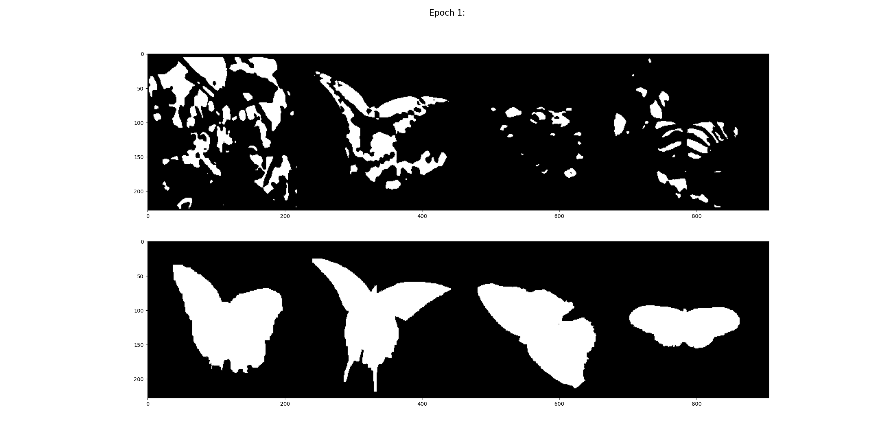
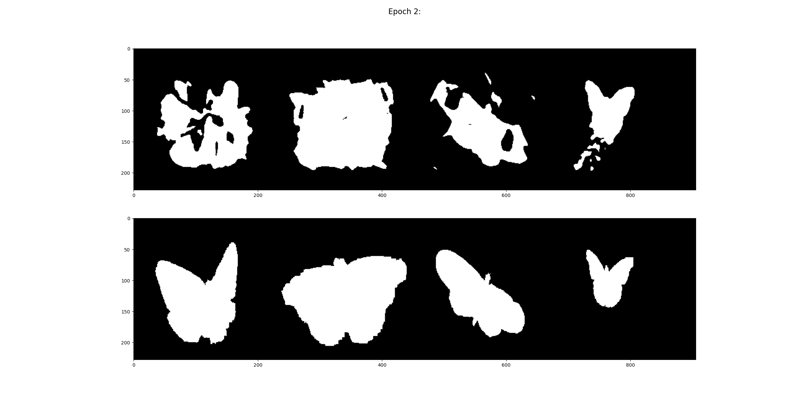
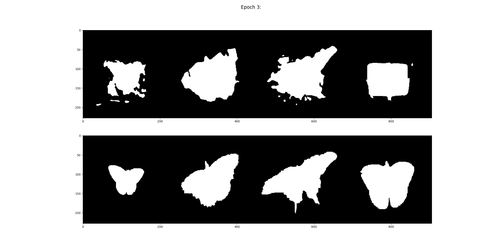
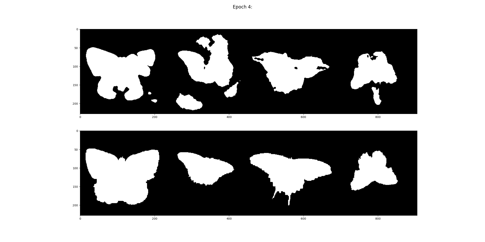
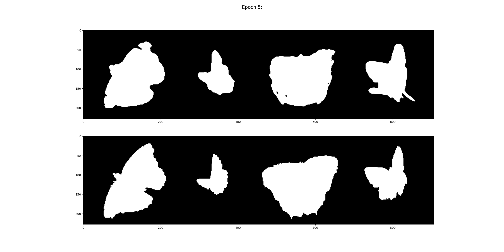
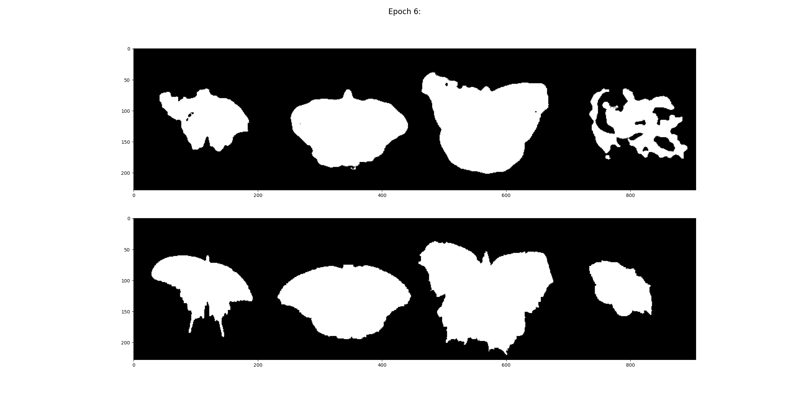
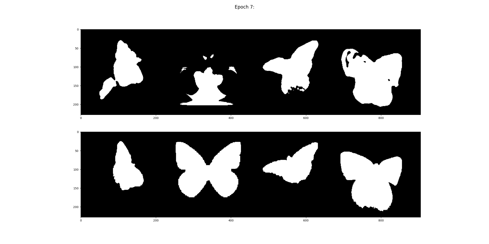
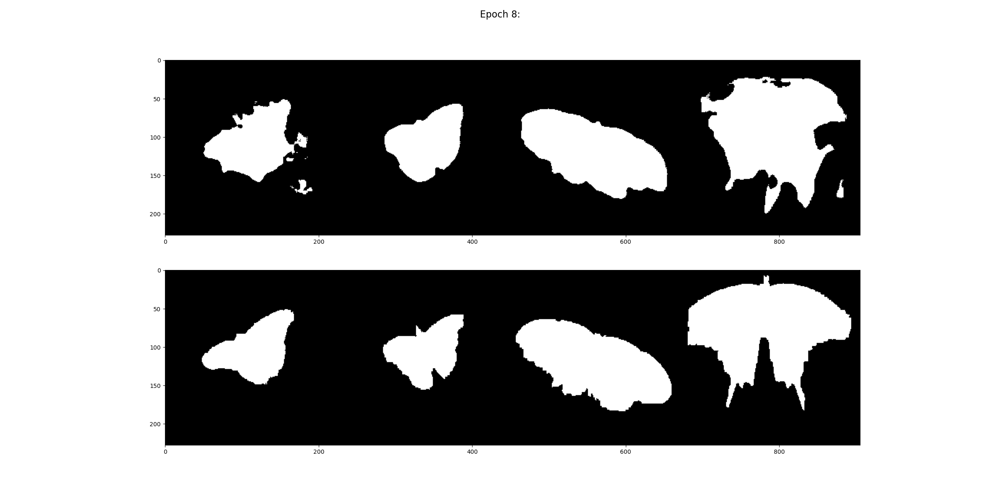
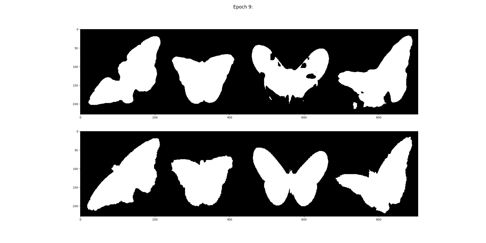
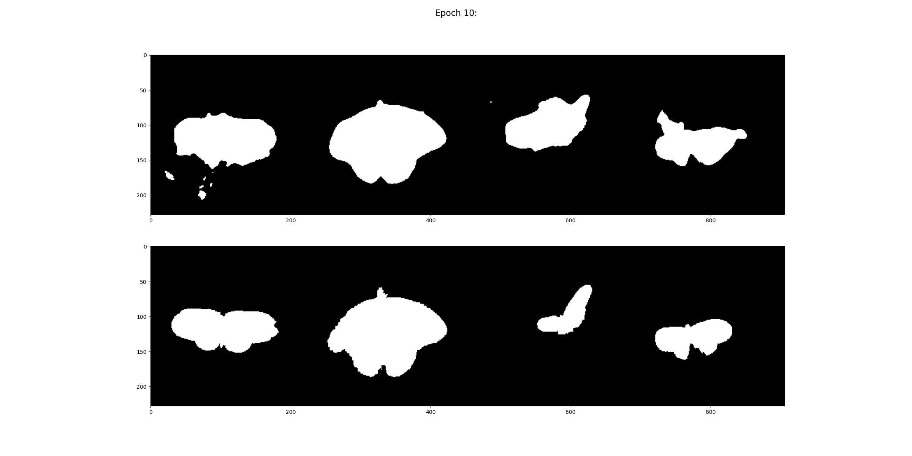

# UNet for Image Segmentation

## Example:

### Dataset:
The Leeds Buterfly Dataset [[download](http://www.josiahwang.com/dataset/leedsbutterfly/)]

>Josiah Wang, Katja Markert, and Mark Everingham
Learning Models for Object Recognition from Natural Language Descriptions
In Proceedings of the 20th British Machine Vision Conference (BMVC2009)

### Train (Focal Loss)
- Epoch 1:
    
- Epoch 2:
    
- Epoch 3:
    
- Epoch 4:
    
- Epoch 5:
    
- Epoch 6:
    
- Epoch 7:
    
- Epoch 8:
    
- Epoch 9:
    
- Epoch 10:
    

